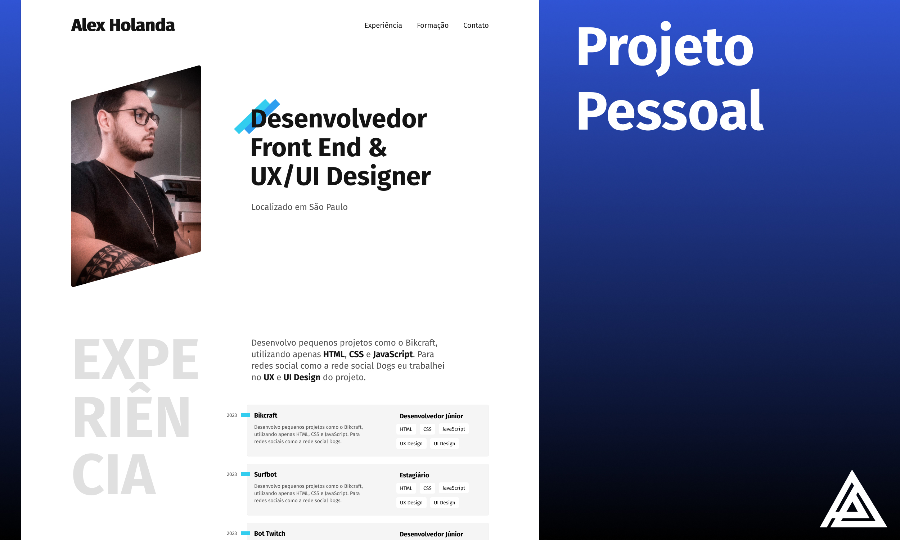

# Alex Holanda - Portfolio Pessoal Origamid

> Portifolio pessoal desenvolvido no curso da ORIGAMID.

    

## Design

O design do site de portfólio foi cuidadosamente elaborado no Figma, utilizando princípios de UI (User Interface) para criar uma experiência atraente e intuitiva. Cada seção foi planejada com o objetivo de destacar meus projetos, habilidades e história profissional de maneira coesa.

A paleta de cores, tipografia e disposição dos elementos foram escolhidas meticulosamente para refletir minha identidade e transmitir uma mensagem visual coesa. A integração de ícones e imagens contribuiu para enriquecer a narrativa visual do meu portfólio.

## Desenvolvimento

Com o design finalizado no Figma, dei o próximo passo no desenvolvimento, traduzindo cada elemento visual para código utilizando HTML e CSS. A estrutura do site foi construída de forma lógica e semântica, garantindo não apenas a estética, mas também a acessibilidade e a indexação eficiente pelos motores de busca.

A responsividade foi uma prioridade, garantindo que meu portfólio seja acessível em dispositivos de diferentes tamanhos e formatos. Media queries e técnicas avançadas de CSS foram aplicadas para criar uma experiência consistente em desktops, tablets e smartphones.

## Tecnologias Utilizadas

    
 

## Desenvolvedor

Desenvolvido Por:

<table>
  <tr>
    <td align="center">
      <a href="#">
         
        
          <b>Alex Holanda</b>
        
      </a>
    </td>
  </tr>
</table>
